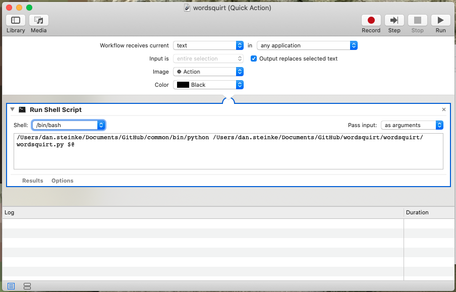

# wordsquirt
 Python based text snippet expander for macos. My grandfather used to call writing implements, "word squirters".

## Python Package requirements (one day I'll learn to package my software):
` TinyDB `

## Sources:
Based off this article:
[https://chrisrosser.net/posts/2017/01/02/macos-system-wide-snippet-database/](Macos System Wide Snippet Database - chrisrosser.net)
abc

## Set up
Until I work out if/how I can register Automator services from a Python script, some assembly will be required:
### wordsquirt automator config:

### wordsuck automator config:

### Keyboard shortcut config (under services):

